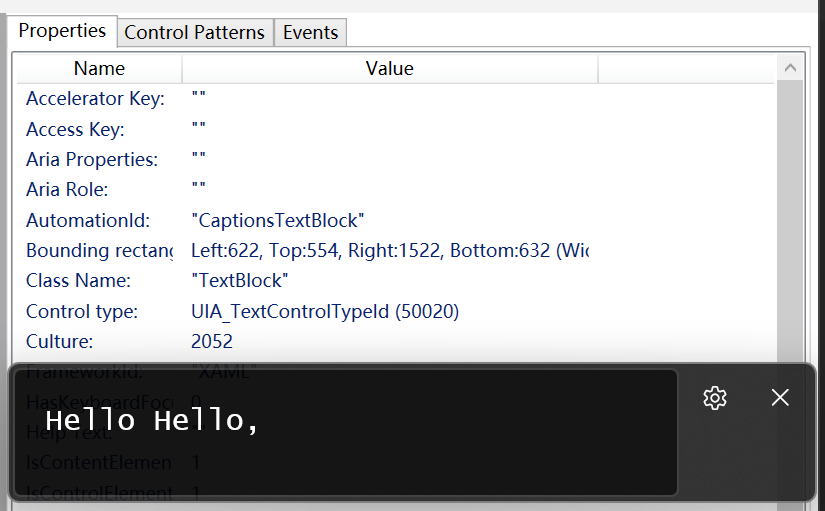

# get-livecaptions-cpp
Get real time content of Windows System APP "Live Captions" [win+ctrl+L], write content into file. using c++/winrt, asio.  
And translate into English using local translate server: [LibreTranslate](https://github.com/LibreTranslate/LibreTranslate)

check slibing project [get-livecaptions-rs](https://github.com/corbamico/get-livecaptions-rs)

## Usage

```cmd
Usage: get-livecaptions [--help] [--version] [--translate <lang>] [--translate-host HOST] --output <file>

Write the content of LiveCaptions Windows System Program into file, continually.
Translate captions if --translate is specified, using libretranslate(gh:LibreTranslate/LibreTranslate).

Optional arguments:
  -h, --help              shows help message and exits
  -v, --version           prints version information and exits
  -t, --translate <lang>  translation from language, values as es,fr,de,it.
  --translate-host HOST   libretranslate server running at HOST, default as (http://127.0.0.1:5000).
  -o, --output <file>     filename, write content into file. use - for console. [required]
```

## UIAutomation

To find the LiveCaptions GUI AutomationID, you may need tools as [inspect](https://learn.microsoft.com/en-us/windows/win32/winauto/inspect-objects), or [Automation-Spy](https://github.com/ddeltasolutions/Automation-Spy)



## License

Licensed under either of

 * Apache License, Version 2.0
   ([LICENSE-APACHE](LICENSE-APACHE) or http://www.apache.org/licenses/LICENSE-2.0)
 * MIT license
   ([LICENSE-MIT](LICENSE-MIT) or http://opensource.org/licenses/MIT)

at your option.

## Contribution

Unless you explicitly state otherwise, any contribution intentionally submitted
for inclusion in the work by you, as defined in the Apache-2.0 license, shall be
dual licensed as above, without any additional terms or conditions.

